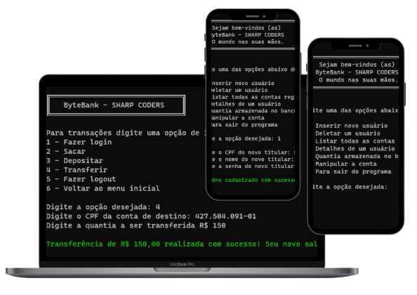

<h1 align="center"> SHARP CODERS | Projeto ByteBanka C# - 2022/2023 </h1>

Formação Desenvolvedor C#, promovido pela Imã Learning Place | Sharp Coders.

  <a href="#-tecnologias">Tecnologias</a>&nbsp;&nbsp;&nbsp;|&nbsp;&nbsp;&nbsp;
  <a href="#-teacher">Teacher</a>&nbsp;&nbsp;&nbsp;|&nbsp;&nbsp;&nbsp;
  <a href="#-bootcamp">Bootcamp</a>&nbsp;&nbsp;&nbsp;|&nbsp;&nbsp;&nbsp;
  <a href="#-projeto">Projeto</a>&nbsp;&nbsp;&nbsp;|&nbsp;&nbsp;&nbsp;
  <a href="#memo-licença">Licença</a>

  

 

  

## 🚀 Tecnologias

Esse projeto foi desenvolvido com as seguintes tecnologias:

- C#
- Git e Github

## 🎓 Teacher

- Agradeço pela oportunidade de crescimento e ótima didática do prof. Hugo Rafael  

## 💻 Bootcamp

- FullStack na [**Ímã learning place**](https://imalearningplace.com) | Sharp Coders 2022
- C# focado em Lógica de Programação e Algoritmos
- Agradecimentos pelas dicas e compreensão ao time Imã, Fran Coimbra -  e Julio Vieira - , por último e não menos importante, os fundamentais e caros colegas que estão sempre disponíveis na solução dos problemas e dúvidas no código.

## #️⃣ = ❎ e 0️⃣ Projeto

Este é o código principal de um sistema de gerenciamento de contas bancárias, escrito em C#. O código inclui uma função "InitialMenu" que exibe um menu principal para o usuário, com opções de inserir um novo usuário, deletar um usuário, listar todas as contas registradas, exibir os detalhes de um usuário, exibir o valor total armazenado no banco e manipular uma conta específica.

Existe também uma função "Main" que é o ponto de entrada para o programa. Dentro desta função, há quatro listas: "cpfs", "names", "passwords" e "balances". Estas listas armazenam os respectivos dados de cada conta bancária: CPF, nome, senha e saldo.

A função "Main" então entra em um loop infinito, exibindo o menu principal e esperando a entrada do usuário. Quando o usuário digita um número de opção e pressiona Enter, o programa valida se a entrada é um número inteiro válido usando o método "TryParse" da classe "int". Se a entrada for válida, o programa entra em um "switch" com base na opção selecionada pelo usuário. Cada opção chama uma função específica para realizar a ação desejada.

Se o usuário digitar "0", o programa exibe uma mensagem de agradecimento e sai do loop infinito. Se o usuário digitar uma opção inválida, o programa exibe uma mensagem de erro e volta ao início do loop.

Abaixo estão os detalhes do submenu de acesso a conta do usuário:

- Na opção "1", a função "RegistrarNovoUsuário.Registrar" é chamada com as quatro listas como argumentos. Esta função solicita ao usuário que informe os dados da nova conta bancária (CPF, nome, senha e saldo inicial) e adiciona esses dados às listas correspondentes.
- Na opção "2", a função "DeletarUsuario.Deletar" é chamada com as quatro listas como argumentos. Esta função solicita ao usuário que informe o CPF da conta bancária que deseja deletar e remove os dados dessa conta das listas.
- Na opção "3", a função "ListarTodasAsContas.Listar" é chamada com as quatro listas como argumentos. Esta função exibe a lista de todas as contas bancárias registradas, incluindo o CPF, o nome e o saldo de cada conta.
- Na opção "4", a função "ApresentarUsuario.Apresentar" é chamada com as quatro listas como argumentos. Esta função solicita ao usuário que informe o CPF da conta bancária que deseja visualizar e exibe os detalhes da conta, incluindo o nome e o saldo.
- Na opção "5", a função "ApresentarValorAcumulado.Apresentar" é chamada com a lista "balances" como argumento. Esta função exibe o valor total armazenado em todas as contas bancárias.
- Na opção "6", a função "Submenu.ManipularConta" é chamada com as quatro listas como argumentos. Esta função exibe um submenu com opções adicionais para manipular uma conta bancária específica, como realizar uma transferência ou verificar o saldo.

## :memo: Licença

- Esse projeto está sob a licença MIT

